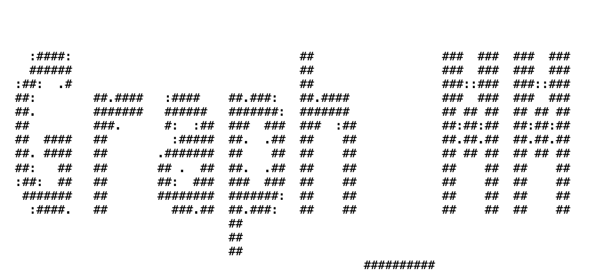

# Graph-based metamodeling (GraphMM) to uncover cell dynamics and function across molecular, cellular, and multicellular scales

This is the official repository for GraphMM, a Python package to uncover cell dynamics and function across molecular, cellular, and multicellular scales.

<p align="center">
  
</p>

# Introduction

We introduce Graph-based Metamodeling (GraphMM), a novel framework that integrates models across multiple representations and spatiotemporal scales, by (i) converting input models into universal surrogate representations using probabilistic graphical models; (ii) coupling surrogates across time scales using a standardized strategy; and (iii) approximate metamodel inference. Validation through synthetic benchmarks and real-world applications shows improved accuracy over existing methods. GraphMM enables quantitative predictions of $\beta$-cell dynamics and function across molecular, cellular, and multicellular scales. GraphMM provides a versatile framework for integrating models to uncover the dynamics of complex systems. 
For detailed documentation, please visit: https://graphmm.readthedocs.io/

# Protocol

This protocol describes how to use GraphMM to couple two input models that share **one common variable** (e.g., a concentration, secretion rate, or any other biological quantity). It follows a three‑stage graph‑based metamodeling framework. For a ready‑to‑run example, see the [**Benchmark - Toy GSIS metamodel**](#benchmark---toy-gsis-metamodel).

## Step 1 – Identify the two input models and the connecting variable

Assume we have two models $M1$ and $M2$. They may operate on different time scales.  
Find a **connecting variable** $b$ that appears (or has a semantic equivalent) in both models.  
Example:  
- $M1$ outputs insulin secretion rate $S^C$ (cell model).  
- $M2$ uses insulin secretion rate $S^B$ (body model).

## Step 2 – Convert each input model into a probabilistic surrogate (Stage 1)

For each model $M^i$ ($i=1,2$), build a State‑Space Model (SSM) – a probabilistic graphical model.

Extract the state variables $Z^i_t = (a^i_t, b^i_t)$ and define the process model:

$$
p(Z^i_{t+1} \mid Z^i_t) = \mathcal{N}\bigl( f(a^i_t, b^i_t), \phi^i_t \bigr)
$$

- $f^i$ is the forward function (e.g., ODEs) from the input model.
- $\phi^i_t$ is transition noise (e.g., $10^{-3}$ of the variable mean).

If desired, also define an observation model:

$$
p(O^i_t \mid Z^i_t) = \mathcal{N}\bigl( g(a^i_t, b^i_t), \epsilon^i_t \bigr)
$$

## Step 3 – Unify time steps across models (Stage 2)

Choose a universal time step $\Delta t$ (e.g., the smallest native time step).  
- For a model with a **smaller** native time step, redefine the process model at $\Delta t$ using the original forward function; the observation model is subsampled or interpolated.  
- For a model with a **larger** native time step, also redefine the process model at $\Delta t$; the observation model is linearly interpolated (if experimental data exist) or kept identical.

## Step 4 – Couple the two surrogates *via* the shared variable

Let the connecting variables be $b^1$ (from $M1$) and $b^2$ (from $M2$).  
Assume Gaussian distributions at each time step: $p(b^1_t) = N(\mu^{b1},\sigma^{b1})$, $p(b^2_t) = N(\mu^{b2},\sigma^{b2})$.

**4.1 Introduce a latent coupling variable** $c_t$ with a mixture prior (equal weights):

$$
p(c_t^{12}) = \mathcal{N}\bigl( h(b^1_t,b^2_t), \rho_t \bigr)
$$
$$
h(b^1_t,b^2_t) = 0.5\mu^{b1} + 0.5\mu^{b2}
$$
$$
(\rho_t)^2 = 0.5(\sigma^{b1})^2 + 0.5(\sigma^{b2})^2 + 0.5\times0.5\(\mu^{b1}-\mu^{b2})^2
$$

**4.2 Build the coupling graph** with directed edges: $b^1_t \leftarrow c_t^{12} \rightarrow b^2_t$.  
Define the conditional distributions (predictive update) as a weighted combination of the coupling variable and the original model dynamics:

$$
p(b^1_{t+1} \mid c_t^{12}, a^1_t, b^1_t) = \mathcal{N}\Bigl( \omega_t^1 y_t + (1-\omega_t^1) f^1(a^1_t,b^1_t), \phi^1_t \Bigr)
$$
$$
p(b^2_{t+1} \mid c_t^{12}, a^2_t, b^2_t) = \mathcal{N}\Bigl( \omega_t^2 y_t + (1-\omega_t^2) f^2(a^2_t,b^2_t), \phi^2_t \Bigr)
$$

Here $\omega_1$ and $\omega_2$ are weights determined by the overlap of the coupling variable distribution with each connecting variable distribution. When no prior knowledge exists, set both to $0.5$.

## Step 5 – Perform metamodel inference (Stage 3)

Build a factor graph containing all state variables $Z^i$ and the coupling variable $c$. Use:

- **Unscented Kalman Filter (UKF)** if all variables are approximately Gaussian,
- **Particle Filter (PF)** for non‑Gaussian distributions (higher accuracy, but slower).

Recursively apply the predict‑update cycle:

- **Predict:**  
$P (Z_t \mid O_{1:t-1}) = \int_{Z_{t-1}} \int_{c_t} P (Z_t, C_t \mid Z_{t-1}) dC_t P (Z_{t-1} \mid O_{1:t-1}) dZ_{t-1}$

- **Update (Bayes):**  
$P (Z_t \mid O^1_{1:t}) = \frac{P (O_t \mid Z_t) P (Z_t \mid O_{1:t-1})}{P (O_t \mid O_{1:t-1})}$

The resulting metamodel outputs mean and standard deviation for all original state variables and the coupling variable.

## Notes for other applications

- **Connecting variable selection:** If the two models do not share an identical variable, choose the pair with the highest Pearson correlation coefficient (as in the VE‑ISK coupling in the paper).
- **Time‑step selection:** Ensure the ODE solver remains stable at the chosen universal time step.
- **Noise calibration:** Set transition noise $\phi$ and emission noise $\epsilon$ as fractions (e.g., $0.001$–$0.01$) of the variable’s mean value to preserve biological variability.
- **Inference choice:** Start with UKF for speed; switch to PF if you observe strong non‑Gaussianity.

For a complete runnable implementation of this protocol, refer to the `Benchmark/` folder (toy GSIS metamodel) or the **Colab notebook linked** below.

# Repo Structure

The project contains a benchmark and a Multiscale β-cell metamodel (MuBCM), both using the GraphMM modeling framework. The project structure is as follows:
1. `Benchmark/`: Contains the benchmark toy system for GraphMM using a toy GSIS model.  
**Quick start**: [](https://colab.research.google.com/drive/1mmF2elmdj9g20Y7XFUviKmAUEDBGiv6K?usp=sharing)
   

2. `GraphMM_MuBCM/`: The main package for GraphMM
     - `InputModel/`:
        - Contains subsystem models 
    - `GraphMetamodel/`:
        - Defines connections between surrogate models
        - Implements multi-scale inference
    - `results/`:
        - Stores output files from model simulations 

# Usage

### Prerequisite

```bash
python           3.7
scikit-learn     1.0.2
pandas           1.3.5
numpy            1.21.6
scipy            1.7.3
filterpy         1.4.5
daft             2.10.0
matplotlib       3.5.3
jupyter          1.0.0
ipykernel        6.15.2
```

### Benchmark - Toy GSIS metamodel
* 1. Prepare and check input model:
```bash
cd InputModel
python Subsystem.py #plot_inputmodel will show the results of input model
```

* 2. Convert input model into surrogate model:
```bash
python Surrogate_model_a.py  #Convert Input model a into Surrogate model a
python Surrogate_model_b.py  #Convert Input model b into Surrogate model b
```
plot_surrogatemodel will show the results of surrogate model
Results will be saved in the `results/surrogate_model_{i}.csv` directory

* 3. Run metamodel of the two toy models
```bash
python compare_PF_UKF.py # 
```
The distributions of metamodel variables are then estimated using Unscented Kalman Filters (UKFs) for Gaussian distributions and Particle Filters (PF) for non‑Gaussian distributions

* 4. Visualizations can be generated using the plotting functions in the script
```bash
python visulize.py
```


### Multiscale β-cell metamodel (MuBCM)
* 1. Prepare and check input model:
```bash
cd InputModel/Input_ICN  # Firstly, run ICN input model to get potential of cells 
python IsletHubCell_forward_function_sec.py # The unit of ICN model is 'second'
```
Input results will be saved in the `'./InputModel/Input_ICN/input_ICN_600s_nohub/` directory.

* 2. Convert input model into surrogate model:
```bash
python run_surrogate_ISK_active.py # The unit of ISK model is 'minute'
python run_surrogate_ICN_active.py
python run_surrogate_VE_active.py  # The unit of ISK model is 'minute'
```
Surrogate results will be saved in the `'./results/surrogate_{cell_number}_600s_nohub/` directory.

* 3. Run metamodel of the three surrogate models
```bash
python run_MuBCM_metamodel_active.py  # The units of the ICN model will be unified to minutes.
```
Metamodel results will be saved in the `'./results/Metamodel_VE_ICN_ISK_600s_nohub/` directory.
All variable values of the three models after metamodel updating will be stored in Metamodel_VE_IHC_ISK_600s_nohub_{cell_number}.csv files, with one column for the mean and one column for the standard deviation. Since each Metamodel_VE_IHC_ISK_600s_nohub_{cell_number}.csv file is very large, you can extract the columns of interest as needed.

* 4. Check whether the variable is correctly coupled using the plotting functions in the script
```bash
python plot_coupling.py
```

# Citation

If you use GraphMM in your research, please cite our papers: \url{}

# Copyright

© 2024 GraphMM Project Contributors (contact: <a href="mailto:chenxi.wang@salilab.org">chenxi.wang@salilab.org</a>). All rights reserved. This project and its contents are protected under applicable copyright laws. Unauthorized reproduction, distribution, or use of this material without express written permission from the GraphMM Project Contributors is strictly prohibited. For inquiries regarding usage, licensing, or collaboration, please contact the project maintainers.
